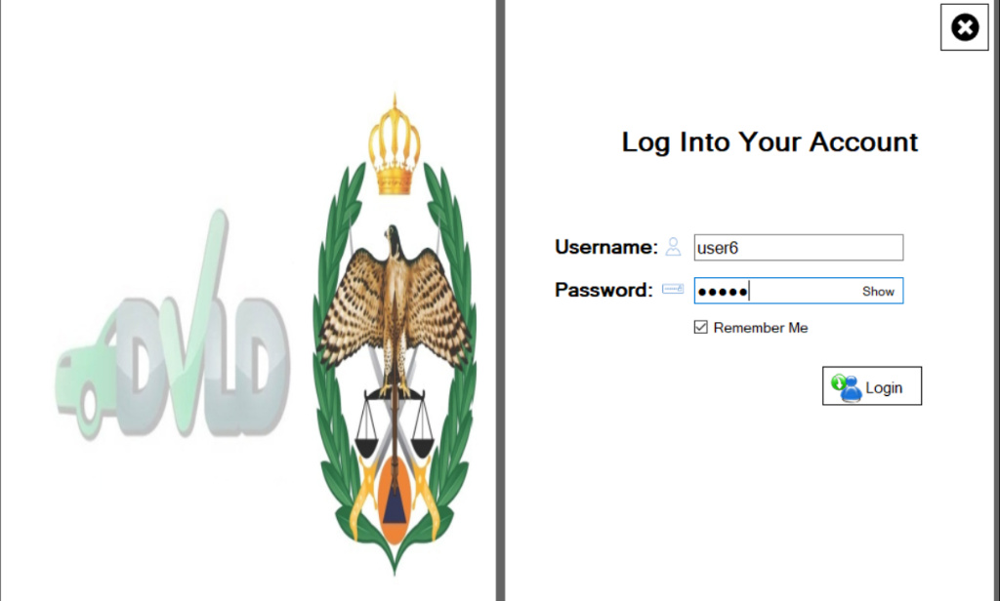
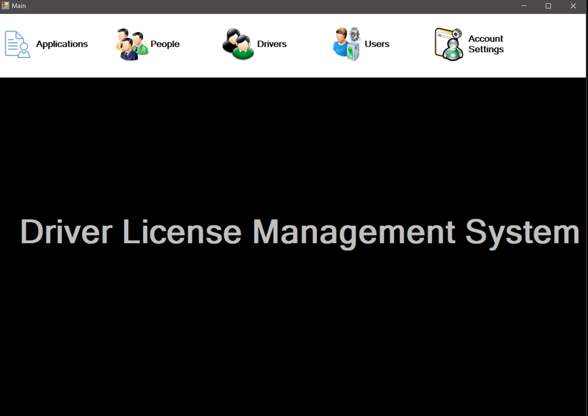
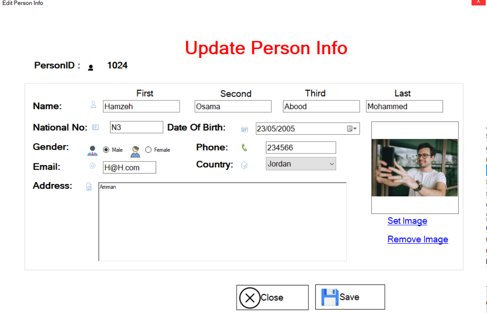
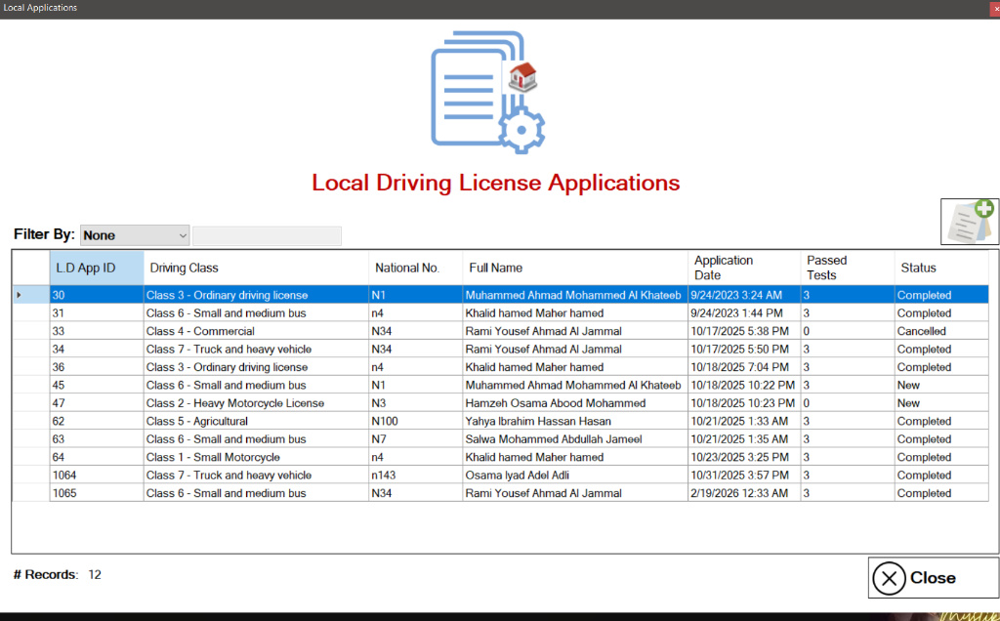
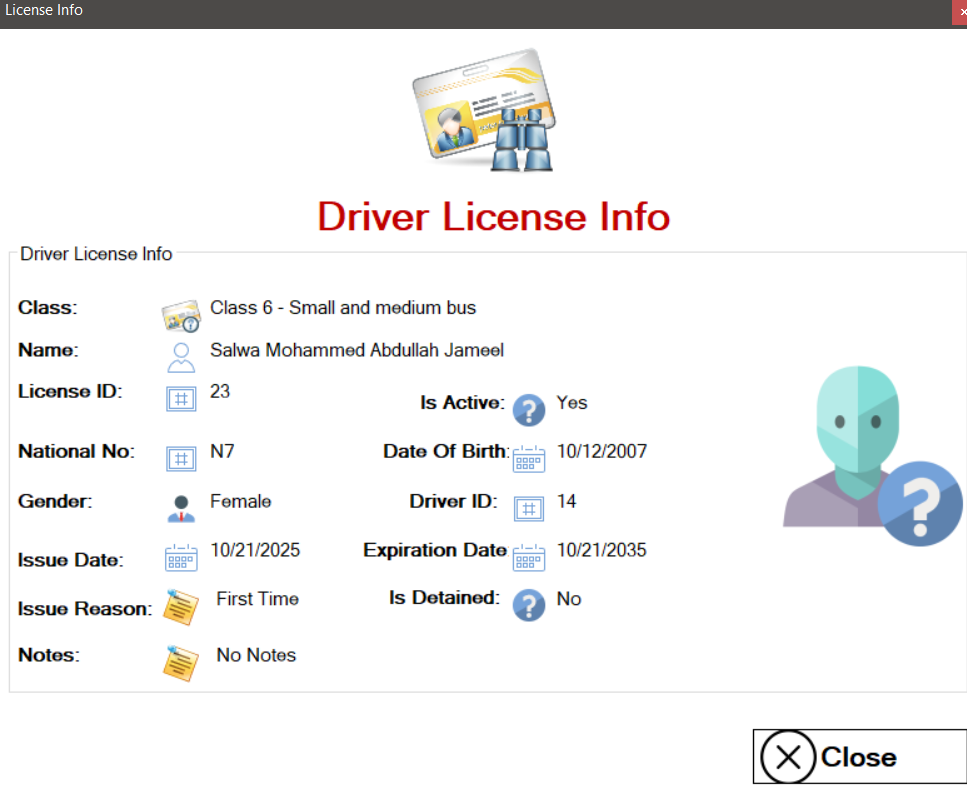
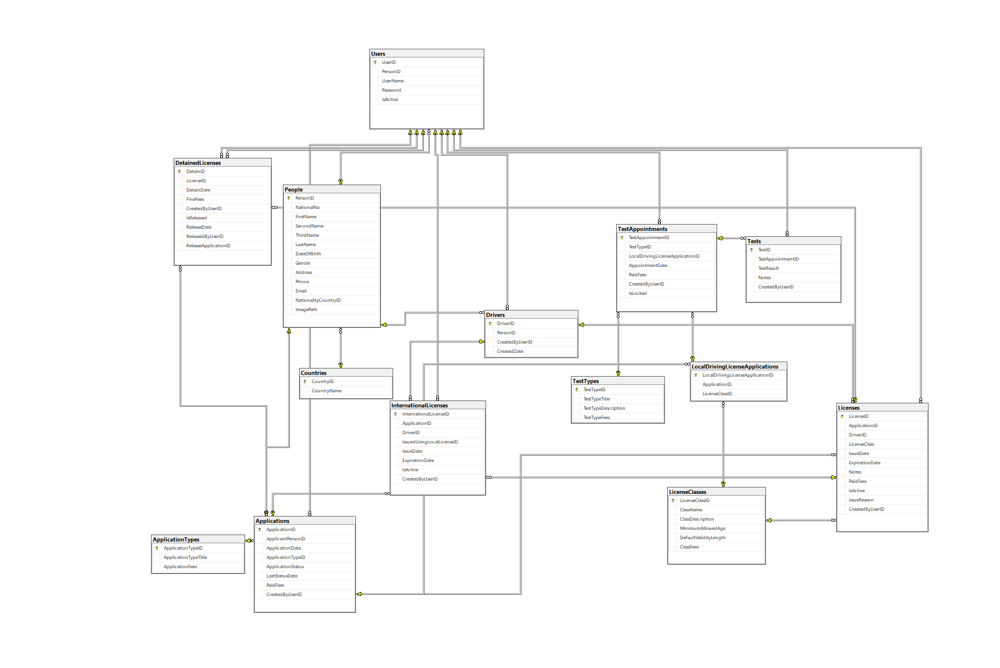

# Driving License Management System (DVLD)

A comprehensive Windows Forms desktop application designed to manage driver records, license issuance, and user administration, backed by a robust SQL Server database.

## Tech Stack
* Frontend: Windows Forms (C#)
* Database: SQL Server
* Architecture: 3-Tier Architecture (Presentation, Business, Data Access)

## Architecture Overview
The application is structured using a strict 3-tier architecture to decouple the UI from data processing, ensuring clean, maintainable code:
* Presentation Layer: The Windows Forms UI handling user interactions and data presentation.
* Business Layer: Processes validation, business rules, and logic for complex operations like license issuance and renewals.
* Data Access Layer: Executes optimized CRUD operations and communicates directly with the SQL Server database.

## Key Features
* Driver Record Management: Comprehensive tools to add, update, and manage detailed applicant profiles and test appointments.
* License Processing: Secure business logic for issuing new licenses, renewing expired ones, and replacing lost/damaged documents.
* Structured Data Handling: Fully normalized database schema ensuring data integrity and fast query execution across thousands of records.

## Local Setup
1. Clone the repository.
2. Restore the SQL Server database using the provided SQL scripts in the database folder.
3. Update the database connection string in the `App.config` file.
4. Open the solution in Visual Studio, build, and run the application.
=======
## Tech Stack
* Frontend: Windows Forms (C#)
* Database: SQL Server
* Architecture: 3-Tier Architecture

## Architecture Overview
The application is structured using a strict 3-tier architecture to decouple the UI from data processing, ensuring clean, maintainable code:
* Presentation Layer (DVLDPresentationLayer): The Windows Forms UI where user interaction occurs.
* Business Layer (DVLDBusinessLayer): Handles validation, business rules, and logic for license processing.
* Data Access Layer (DVLDDataAccessLayer): Executes optimized CRUD operations and communicates directly with the SQL Server database.

## Database Architecture

## Key Features
* Driver Record Management: Add, update, and manage detailed applicant profiles.
* License Processing: Logic for issuing, renewing, and tracking driving licenses.
* Structured Data Handling: Fully normalized database schema ensuring data integrity and fast query execution.

## Local Setup
1. Clone the repository.
2. Restore the SQL Server database using the provided scripts.
3. Update the database connection string in the configuration file.
4. Open the solution (DVLD.sln) in Visual Studio and run the application.